# Agent Factory

> **A agentic way of creating new agents on the fly only with the tools available. following the SRP principle single responsibility principle same followed in code**
---

## Table of Contents
- [Overview](#overview)
- [Architecture](#architecture)
- [Core Capabilities](#core-capabilities)
- [Technology Stack](#technology-stack)
- [Future Enhancements](#future-enhancements)
- [License](#license)
---

## Overview
The **Agent Factory** enables organizations to discover tools automatically, generate agents on demand, enforce human approval workflows, and index and reuse agent capabilities — all within a governed, auditable control plane.

Unlike static agent systems, this platform creates agents **only when required**, ensuring scalability, cost efficiency, and compliance across large tool ecosystems.

| Capability | Description |
|---|---|
| 🔍 **Semantic Discovery** | Vector + BM25 hybrid search over agent capabilities and tools |
| ⚙️ **Dynamic Provisioning** | Agents generated on demand, not pre-deployed |
| 🔒 **Approval-Gated** | Every new agent passes through a human review workflow |
| 📡 **Multi-Channel** | Bind agents to Discord, Slack, Microsoft Teams |
| 📋 **Audit-Ready** | Full metadata and lifecycle tracking |

---

## Architecture

The platform is composed of five primary layers: **Orchestration**, **MCP Runtime**, **Agent Provisioning Engine**, **Search & Index (OpenSearch)**, and **Integration**.

### Runtime Architecture

---

### Deployment & CI/CD Architecture

```mermaid
flowchart LR
    classDef mcp fill:#7B68EE,stroke:#4B3BA8,color:#fff,rx:8
    classDef cicd fill:#FF8C42,stroke:#C26A28,color:#fff,rx:8
    classDef data fill:#20B2AA,stroke:#148A82,color:#fff,rx:8
    classDef index fill:#48BB78,stroke:#2F855A,color:#fff,rx:8

    MCP["🟣 MCP Server"]:::mcp

    subgraph CICD_PIPELINE["  CI/CD Pipeline  "]
        direction TB
        FETCH["📥 Fetch Registered Tools"]:::cicd
        INGEST["🔄 Ingest Tool Context"]:::data
        DEPLOY["🚀 Deploy MCP Server"]:::cicd
    end

    subgraph SEARCH_INDEX["  Search & Index  "]
        OS["📦 OpenSearch\nVector + BM25 Hybrid"]:::index
    end

    MCP --> CICD_PIPELINE
    FETCH --> INGEST
    INGEST --> OS
    CICD_PIPELINE --> DEPLOY
```

---

### Runtime Decision Model

```mermaid
flowchart TD
    classDef start fill:#4A90D9,stroke:#2C5F8A,color:#fff,rx:20
    classDef decision fill:#FF8C42,stroke:#C26A28,color:#fff,rx:6
    classDef action fill:#48BB78,stroke:#2F855A,color:#fff,rx:6
    classDef approval fill:#E05C6E,stroke:#A83848,color:#fff,rx:6
    classDef terminal fill:#7B68EE,stroke:#4B3BA8,color:#fff,rx:20

    A(["📨 Receive Request"]):::start
    B["🔍 Search Existing Agents\nVector + BM25 Hybrid"]:::action
    C{{"Match\nFound?"}}:::decision
    D(["✅ Invoke Existing Agent"]):::terminal
    E["🔧 Search Available Tools"]:::action
    F["⚙️ Generate Candidate Agent"]:::action
    G["📋 Submit for Approval"]:::approval
    H{{"Approved?"}}:::decision
    I["📦 Index Agent Metadata"]:::action
    J(["🚀 Activate Runtime Instance"]):::terminal
    K(["🚫 Request Declined"]):::approval

    A --> B
    B --> C
    C -->|Yes| D
    C -->|No| E
    E --> F
    F --> G
    G --> H
    H -->|Yes| I
    H -->|No| K
    I --> J
```

---

## Core Capabilities

### 1. Dynamic Agent Generation

Agents are generated only when no suitable agent exists, required tools are available, and approval conditions are satisfied. This prevents uncontrolled agent proliferation and maintains operational discipline.

### 2. Approval-Gated Provisioning

All dynamically generated agents must pass through an approval workflow before activation, ensuring security review, cost validation, tool risk assessment, and compliance enforcement.

### 3. Hybrid Semantic Discovery (Vector + BM25)

OpenSearch powers a **hybrid retrieval strategy** combining:

- **Dense vector search** — semantic similarity via embedding models for fuzzy capability matching
- **BM25 keyword search** — precise lexical matching for tool names and structured metadata
- **Reciprocal Rank Fusion (RRF)** — merges both result sets for optimal ranking

This combination reduces redundant agent creation and ensures both semantically similar and keyword-exact agents are surfaced during discovery.

### 4. Asynchronous Provisioning

Agent creation runs in the background to ensure low runtime latency, non-blocking orchestration, and scalable provisioning under load.

### 5. Multi-Channel Agent Binding

Approved agents can be bound to Discord, Slack, or Microsoft Teams. Additional integrations can be added via adapter modules.

---
## Technology Stack

| Layer | Recommended Technology |
|---|---|
| **API Layer** | FastAPI |
| **Search & Index** | OpenSearch (Vector + BM25 Hybrid) |
| **Background Workers** | Asyncio Background Runner |
| **Vector Embeddings** |  Ollama models |
| **CI/CD** | GitHub Actions |
| **Runtime** | MCP-compatible server |
---

## Future Enhancements

- Capability similarity threshold enforcement
- Instead of asyncio durable runner like temporal or lightweight bg runner like rstate can be added
- Automated agent version regeneration on tool change
- Policy engine for automated risk 
- Cost tracking and budget enforcement per agent
- Usage analytics dashboard
- Multi-tenant isolation
- Agent archival and lifecycle automation
---

## License
This project is licensed under the **MIT License**. See `LICENSE` for details.
---
